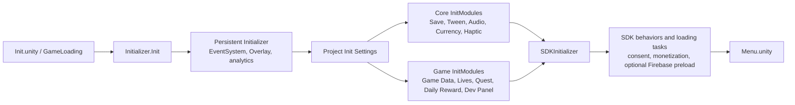
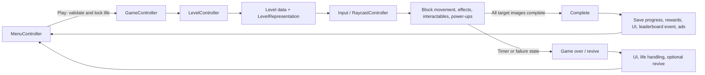

# NebulaSoft SDK — Picture Puzzle Template

NebulaSoft SDK is a Unity mobile-game template that combines a reusable service layer with a complete Picture Puzzle implementation. It is designed as a starting point for casual puzzle games: shared systems live in `NebulaSoft Core`, while game-specific rules, content, UI, and scenes live in `Project Files`.

This repository currently targets **Unity 6000.3.12f1** and package version **1.2.2**. Its enabled build scenes are:

1. `Assets/Project Files/Game/Scenes/Init.unity`
2. `Assets/Project Files/Game/Scenes/Menu.unity`
3. `Assets/Project Files/Game/Scenes/Game.unity`

> The bundled Picture Puzzle is an implementation example, not a claim that every casual-game mechanic is already included. Reuse the core services and add game-specific modules for a new title.

## Quick start

1. Clone the repository and open it in Unity Hub with Unity **6000.3.12f1**.
2. Let Unity resolve the dependencies declared in `Packages/manifest.json`.
3. Open `Assets/Project Files/Game/Scenes/Init.unity` and press Play. `Init` is the bootstrap scene; do not start a normal play session from `Menu` or `Game` unless the initializer has already run.
4. Use the EditMode tests in `Assets/Tests/Editor` from **Window → General → Test Runner** to validate the local setup.

### Optional service integrations

Firebase, Facebook login, advertising, and in-app purchases are optional product integrations. Before shipping a new game, configure the corresponding provider accounts, platform identifiers, consent flow, store products, and platform configuration files for *your own* application. Do not commit credentials, signing keys, API secrets, or production configuration copied from another app.

Firebase-dependent code is conditionally compiled with `FIREBASE`; Facebook support is guarded by `FACEBOOK`. The monetization layer also uses feature symbols such as `MODULE_IAP`, `MODULE_ADMOB`, `MODULE_ADSKIT`, and `UNITY_IAP_NEW`. A feature should be enabled only after its package and platform setup are complete.

## Project layout

```text
.
├── Assets/
│   ├── NebulaSoft Core/        # Reusable framework services and editor tooling
│   ├── Project Files/          # Picture Puzzle data, gameplay, UI, art, and scenes
│   │   ├── Data/               # ScriptableObject databases and game configuration
│   │   └── Game/
│   │       ├── Scenes/         # Init, Menu, Game, and Level Editor scenes
│   │       ├── Scripts/        # Game-specific runtime and editor code
│   │       ├── Prefabs/        # UI, blocks, effects, power-ups, environments
│   │       └── Animations|Audio|Images|Models|Materials|Textures|Shaders/
│   ├── Addon/                  # Add-on gameplay/UI content and third-party packages
│   ├── Firebase|FacebookSDK|GoogleMobileAds|GooglePlayGames|LevelPlay/
│   │                           # Provider SDKs and integration assets
│   ├── Plugins/                # Native and third-party plugins
│   └── Tests/Editor/           # EditMode regression tests
├── Packages/                   # Unity Package Manager manifest and lock file
├── ProjectSettings/            # Unity project and build settings
└── tools/design/               # Local Figma bridge/export utilities
```

### Ownership boundaries

| Area | Owns | Change here when |
| --- | --- | --- |
| `Assets/NebulaSoft Core` | Generic initialization, persistence, UI, economy, monetization, tweening, and utilities | Improving a reusable capability without coupling it to Picture Puzzle rules |
| `Assets/Project Files` | Picture Puzzle content, game flow, level rules, presentation, and game-specific services | Adding or changing gameplay, content, UI, balancing, or progression for this game |
| SDK/vendor folders | Imported provider SDKs and third-party packages | Updating an integration according to the provider's migration guide; avoid direct feature edits |
| `Packages` and `ProjectSettings` | Dependency versions, editor/build/platform configuration | Upgrading Unity/packages or configuring a new app target |

Do not place new gameplay rules in imported SDK folders or modify third-party source to implement product features.

## Application lifecycle

### Bootstrap

`Init.unity` owns the persistent initialization sequence. `GameLoading` calls `Initializer.Init()`, then initializes registered modules and SDK behaviors/tasks. `Initializer` is kept alive across scene loads, binds the overlay and event system, initializes analytics/static modules, and then delegates to `ProjectInitSettings` and `SDKInitializer`.



`Project Init Settings.asset` contains the registered `InitModule` instances. Each module derives from `InitModule` and creates or initializes one service. Modules should be independent of a particular level or scene whenever possible.

### Menu-to-game runtime flow

`MenuController` prepares menu UI and common controllers. When the player starts, it validates/locks a life and loads `Game.unity`. `GameController` initializes scene services and delegates level construction to `LevelController`. The level controller loads data, accepts input through `RaycastController`, coordinates movement and effects, and resolves success or failure.



## Reusable core modules

The core is organized under `Assets/NebulaSoft Core/Modules`. The table describes responsibility and the normal integration boundary; it does not require every feature to be active in every build.

| Module | Responsibility | Primary entry/configuration | Boundary |
| --- | --- | --- | --- |
| **Initializer** | Persistent bootstrap, registered modules, loading tasks, consent and SDK behavior orchestration | `Initializer`, `GameLoading`, `Project Init Settings.asset`, `SDKInitializer` | Starts services; should not contain Picture Puzzle rules |
| **Save** | Local save-object creation, serialization, autosave, global and named saves | `SaveInitModule`, `SaveController`, `SavePresets` | Feature services own their save models; this module owns storage lifecycle |
| **UI** | Page/popup navigation, overlay, safe area, button audio/haptics feedback | `UIController`, `UIPage`, popup interfaces | UI pages display state; game rules remain in controllers/services |
| **Tween** | Time-based animations, callbacks, coroutines, reusable tween behaviors | `TweenInitModule`, `Tween`, `TweenCase` | Presentation/timing helper; it must not become gameplay state storage |
| **Audio** | Audio clips, music sources, sound playback, audio save state | `AudioInitModule`, `AudioController`, `MusicSource` | Central playback service; content references belong to game assets |
| **Currency** | Currency definitions, balances, remote overrides, rewards and UI views | `CurrencyInitModule`, `CurrencyController`, `CurrencyDatabase` | General economy primitives; game features request grants/spends through it |
| **Reward** | Extensible reward definitions, holders, previews and application helpers | `Reward`, `RewardsHolder`, registration attributes | Compose rewards for game features without hard-coding UI or store logic |
| **Monetization** | Ads, rewarded ads, IAP products, entitlement state, privacy/consent integration | `MonetizationSettings`, `AdsManager`, `IAPManager` | Provider adapters are isolated behind framework managers and compile symbols |
| **Haptic** | Cross-platform haptic patterns, settings, priority and native wrappers | `HapticInitModule`, `Haptic` | Gameplay/UI choose feedback intent; platform wrappers implement it |
| **Pool** | Reusable object pools and scene holders | `PoolManager`, `Pool`, `PoolGeneric` | Owns object reuse, not game-object behavior rules |
| **Analytics** | Analytics module registration and event dispatch integration | `AnalyticsModules`, `AnalyticsController` | Provider/event plumbing; event semantics are defined by the game feature |
| **Defines** | Attributes and tooling for conditional compile definitions | `DefineAttribute` and project symbols | Controls feature compilation; not a runtime dependency container |
| **Skins** | Shared skin-selection extension point used by game data | `SkinController` and game-specific skin databases | The template's concrete level skins live under `Project Files/Data/Skins` |
| **Inspector** | Custom inspector styles and editor presentation support | Core inspector assemblies/settings | Editor-only tooling; no runtime gameplay dependency |

## Picture Puzzle modules

Game-specific code is under `Assets/Project Files/Game/Scripts`. These modules depend on core services but keep Picture Puzzle behavior separate from reusable framework code.

| Group | Main types and assets | How it works |
| --- | --- | --- |
| **Game flow and session** | `GameInitModule`, `GameData`, `GameController`, `MenuController`, `ActiveSession`, `CameraController` | Loads global game settings, holds the selected/displayed level state, switches Menu/Game scenes, and orchestrates win, fail, revive, ads, and completion UI |
| **Level System** | `LevelController`, `LevelDatabase`, `LevelData`, `LevelRepresentation`, `BlockMovementManager`, `LevelBlockBehavior` | Reads a level definition, spawns environment/blocks/interactables, maintains the movement grid, triggers the timer, and completes when all target images are collected |
| **Level authoring** | `Data/Level System`, `Level Editor.unity`, editor windows/drawers | Stores level assets, block visuals, effects, figures, and interactable definitions; editor tooling creates and edits level content without changing runtime engine code |
| **Effects and interactables** | `Level System/Effects`, `Interactable Objects` | Adds reusable obstacles and reactions such as chains, ropes, keys, ice, bombs, pinned/combined effects, and color-aware interactable objects |
| **Input** | `RaycastController`, `InputController`, `IInputMode`, `DefaultClickMode` | Converts screen interaction into selectable/clickable game objects and forwards valid block actions to the level controller |
| **Power Ups** | `PUController`, `PUDatabase`, `PUSettings`, `PUBehavior`, behavior subclasses | Initializes unlocked power-ups, manages purchase/use/UI state, and applies mechanics such as hammer, merge, freeze, and free movement |
| **Lives** | `LivesSystem`, `LivesData`, `LivesSave`, `UIAddLivesPanel` | Persists the life count, restores lives over real time, supports infinite-life rewards, and locks a life before entering gameplay |
| **Quest and Daily Reward** | `QuestService`/`QuestDatabase`; `DailyRewardService`/`DailyRewardDatabase` | Initializes data-driven progression rewards; daily rewards enforce one claim per UTC day and reset the sequence after missed days |
| **Store and No Ads** | `UIStore`, store elements, `UINoAdsOffer`, IAP reward assets | Presents currencies/offers and integrates with the core monetization/reward systems |
| **Remote Config** | `ProgressRemoteConfigData`, `LevelRemoteConfigData`, reward/revive data, `RemoteConfigController` | Reads initialized remote JSON by key and applies runtime overrides, including level hashes/duration and balance/config values |
| **Firebase and profile** | Firebase handlers, profile UI, cloud sync, leaderboard, soft update | Optional cloud identity/progress, no-ads entitlement synchronization, leaderboards, and update checks; compiled safely out when `FIREBASE` is absent |
| **Presentation and retention UI** | `UI`, `Settings`, `Tutorial`, `Feature Announcement`, `Level Map` | Renders pages/popups/HUD, settings, guided onboarding, unlock announcements, and level-map elements |
| **Developer tooling** | `Dev Panel`, level editor code, `Assets/Tests/Editor` | Provides developer controls and EditMode coverage for selected framework/game regressions |

## Data, persistence, and configuration

### Data flow

Most content follows this path:

```text
ScriptableObject database / settings asset
    → InitModule or scene controller
    → Runtime service or behavior
    → SaveController-backed save object (when state must persist)
    → UI / gameplay result
```

Examples include level definitions through `LevelDatabase`, power-up definitions through `PUDatabase`, and retention/economy data through the lives, quest, daily-reward, reward, and currency databases. Keep designer-editable defaults in ScriptableObjects and player-specific state in save models.

`RemoteConfigController` provides an optional runtime override layer. A feature asks for a typed key with `TryGetConfig<T>()`; when a valid payload is present, it overrides the local default for that run. For example, `GameData` reads progress, ads, revive, and reward settings, while `LevelController` may use a level-specific override. Remote values should therefore be validated and backwards-compatible with local content.

Firebase is not required for local play. With `FIREBASE` enabled, the Firebase module can authenticate a player, synchronize selected progress/profile data, maintain no-ads entitlement, preload/submit leaderboards, and check soft updates. Local save remains the base progression store.

### Important configuration assets

| Concern | Main location | Use it to |
| --- | --- | --- |
| Startup modules | `Assets/Project Files/Data/Project Init Settings.asset` | Enable/configure `InitModule` instances and their initialization data |
| Game-wide settings | `Assets/Project Files/Data/Game Data.asset` | Assign the level database and set gameplay defaults, rewards, revive, and ad thresholds |
| Levels and visuals | `Assets/Project Files/Data/Level System/` | Maintain `Level Database.asset`, individual level assets, effects, environment, figures, and block visual data |
| Power-ups | `Assets/Project Files/Data/Power Ups/` | Configure the power-up database and mechanic-specific settings |
| Progression | `Assets/Project Files/Data/Lives Data.asset`, `Data/Quest/`, `Data/Daily Reward/` | Configure lives, quests, and the seven-day daily-reward schedule |
| Monetization and rewards | `Assets/Project Files/Data/Monetization Settings.asset`, `Data/Rewards/` | Configure monetization/reward definitions after provider setup |
| Scenes and build | `ProjectSettings/EditorBuildSettings.asset` | Maintain scene order and enabled build scenes |
| Unity packages | `Packages/manifest.json` | Pin or upgrade Unity Package Manager dependencies |

## Extending the template

Use this pattern when building a new capability:

1. **Put game-specific code in `Assets/Project Files/Game`.** Create a focused service/controller and, where appropriate, a ScriptableObject database and serializable save model.
2. **Add an `InitModule` only for a global service.** Derive from `InitModule`, initialize the service in `CreateComponent()`, then add/configure its asset through `Project Init Settings.asset`. Ensure dependencies such as Save are initialized before the feature needs them.
3. **Keep scene behavior thin.** Scene controllers should assemble scene components and invoke services; reusable behavior should not depend on a particular puzzle scene.
4. **Register UI and scene dependencies deliberately.** Add the necessary prefabs/pages/controllers to the owning scene and initialize them from the existing `UIController`/scene flow rather than relying on arbitrary global lookups.
5. **Use extension points for common systems.** Implement reward, power-up, level-effect, or interactable data/behavior through the existing registries and databases instead of editing vendor or core framework source.
6. **Add an EditMode test for deterministic logic.** Keep behavior-specific tests in `Assets/Tests/Editor` and test persistence, remote-data parsing, and edge cases separately from visual/manual QA.

## Tests and validation

Current EditMode tests cover areas including coin-safe progress, Firebase progress/name registry behavior, network connection behavior, quest rotation, and Figma export/bridge tooling. Run them in Unity Test Runner after changing framework logic or configuration that affects those systems.

Before publishing changes, verify:

- `README.md` paths point to assets that exist in this repository.
- The three build scenes still match `ProjectSettings/EditorBuildSettings.asset`.
- Optional SDK documentation does not imply a provider is mandatory.
- No provider credentials, signing files, secrets, or customer-specific identifiers were added.
- New game features do not require direct edits to imported SDK/vendor source.

## License

This repository does not currently contain an explicit root license file. The source template from which it was prepared carried a commercial-use restriction: compiled games could be distributed, but the template source code and assets could not be redistributed or resold. Do not assume open-source rights; contact the repository owner to confirm the terms that apply to your intended use.
